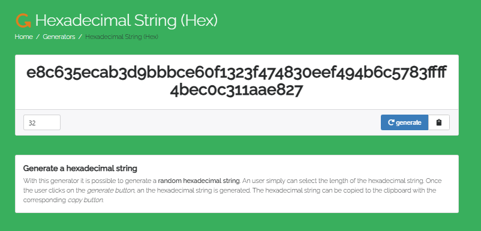

# Getting Started

Welcome to the MirrorVR Setup! It is a long process, but it's easy if you follow along!


Make sure you have removed your old networking system from the scene before you continue.\
See [photonvr-to-mirrorvr.md](../guides/photonvr-to-mirrorvr.md "mention") or [flowvr-to-mirrorvr.md](../guides/flowvr-to-mirrorvr.md "mention") for proper cleanup.



If you have any obfuscators, make sure the following namespaces are added to the skipped namespaces list:\
`Mirror`, `Mirror.VR`, `MetaVoiceChat`, `EpicTransport`


### Dependencies

* **Newtonsoft.Json**
  * Make sure you have this installed. To install, go to `Window > Package Manager`, then hit the `+` icon in the top left, then `Add package by name...`, then type in `com.unity.nuget.newtonsoft-json`, and hit `Add` or `Install`.
* **Unity Version**
  * The recommended Unity version for MirrorVR is Unity 6+, but you should be able to use this package with no issues if you are on Unity 2021.3.35f1+.
* **Universal Render Pipeline**
  * It is recommended to have URP installed before installing this package. It's not required, it's just a suggestion.

### Installation



First, download the latest version of [Mirror](https://github.com/MirrorNetworking/Mirror) and put it into your game.\
Then after Mirror is installed in your project, get the [latest MirrorVR package](https://github.com/MirrorVR/MirrorVR/releases/latest) and put it in your game.




Go to `Assets/MirrorVR` in your Unity Project. That is where the package is located. Now go inside the `Prefabs` folder, and drag the Network Manager prefab into your scene.

<figure><figcaption></figcaption></figure>




Now open up the Network Manager object you just dragged into the scene.\
Assign the Player Transforms to their values. Skip API Keys and Encryption Key for now, we will cover those in a bit.

Go right to the Settings section. Configure then how you want them. If you need details on what some settings do, see [mirror-vr-manager.md](../components/mirror-vr-manager.md "mention").

<figure><figcaption></figcaption></figure>




Now to set up Epic Online Services. If you are using the Dedicated Servers or PlayFab (coming soon) features, you still need to use Epic, as it provides an awesome player management backend to make your game better.\
\
Head right over to the [Epic Games Developer Portal](https://dev.epicgames.com/portal), Sign in, and create an organization if you don't have one already.

<figure><figcaption></figcaption></figure>




Once you have made your organization, hit the `Create Product` button.\
Name your product. It should be your game name. Once done, hit the create button, then wait a bit.

<figure><figcaption></figcaption></figure>



Once your product has been created and it's done loading, click on it. On the left-hand side of your screen, click on the `Product Settings` tab.

<figure><figcaption></figcaption></figure>

Now click on the `Clients` tab.

<figure><figcaption></figcaption></figure>




Scroll towards the bottom, where it says `Client policies`. Click the blue `Add new client policy` button.

<figure><figcaption></figcaption></figure>

Name your policy whatever you want, and set `Policy Type` to be `Peer2Peer`.

<figure><figcaption></figcaption></figure>

At the bottom right of your screen, press the blue `Add new client policy` button.




Now scroll up a little to the `Clients` section. Click the `Add new client` button.

<figure><figcaption></figcaption></figure>

Client Name can be anything. On client policy, select the one we just created. We can skip IP allow list and Redirect URL, as they aren't needed for our case.

<figure><figcaption></figcaption></figure>

On the bottom right of your screen, click the `Add new client` button.




Next, go to the `Epic Account Services` tab.

<figure><figcaption></figcaption></figure>

Hit the `Create Application` button.

<figure><figcaption></figcaption></figure>




We don't need to do anything in the `Brand Settings` tab, so go up to the top right of your screen, and select the `Permissions` tab.

<figure><figcaption></figcaption></figure>

Enable all permissions.

<figure><figcaption></figcaption></figure>

Hit `Save Changes` at the bottom right.




Head over to the `Linked Clients` tab.

<figure><figcaption></figcaption></figure>

Select the client we made, and then hit `Save Changes`.

<figure><figcaption></figcaption></figure>

Now in the top left, hit the `Back to Epic Account Services` button.




Now go back to the `Product Settings` tab.

<figure><figcaption></figcaption></figure>

Under `SDK Download & Credentials`, scroll to the bottom to get your API Keys.



<strong>DO NOT</strong> share these API Keys with <strong>ANYONE</strong>!



<figure><figcaption></figcaption></figure>




Now go back to MirrorVRManager and put these credentials in their fields.

<figure><figcaption></figcaption></figure>

While we are here, let's set the Encryption Key.


The Encryption Key will be used to read and write to Title Storage (10 free GB per app) and Player Data Storage (400 MB or 1000 files per player). Make sure you store it somewhere safe so you can use it later.


&#x20;Go to [this website](https://generate.plus/en/hex) to generate a 32-byte hexadecimal string we can use as the encryption key.\
Set the number in the lower left to 32, copy it, put it into the Encryption Key field in MirrorVRManager, and you're all set!

<figure><figcaption></figcaption></figure>



And basic setup is done! See below for next steps.


If you are using Oculus or Steam, there's setup for those too.\
See [meta-quest-setup.md](meta-quest-setup.md "mention") or [steam-setup.md](steam-setup.md "mention") to do those.



