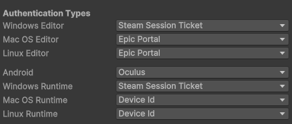

# Steam Setup


Before starting, you must have completed the basic setup. See [.](./ "mention") for basic setup.


Steam is the most popular PC gaming platform, and with the addition of SteamVR, it has become the go-to platform for posting your PCVR games. This brief tutorial will show you how to add Steam support to MirrorVR.



Follow the guide below to set up and prepare your Steam page. If you don't want to purchase an app yet, you are free to use App ID 480 (Space War), just make sure it's in your library before going to the next step.





Download the latest [Steamworks.NET](https://github.com/rlabrecque/Steamworks.NET/releases) package and import it into your project, then restart your project to allow the `steam_appid.txt` file to generate.



Now go to Unity Hub, click the three dots next to your project, then hit either Show in Explorer or Reveal in Finder, depending on what platform you're on.

<figure><figcaption></figcaption></figure>

This will bring you to your project's root directory. Look for a file called `steam_appid.txt` and open it. Paste in either your app ID or `480` into the text, save, then close.



Now go back into your project, and navigate to `Assets/Scripts/Steamworks.NET/SteamManager.cs`. Open it, and scroll down to the Awake method. Search (or press Ctrl/Cmd + F), and paste in `SteamAPI.RestartAppIfNecessary`, then hit enter. You should be on a line that says `if (SteamAPI.RestartAppIfNecessary(AppId_t.Invalid))`. Replace `AppId_t.Invalid` with `(AppId_t)<appid>` (replace \<appid> with your app id, such as 480). The line should now look something like `if (SteamAPI.RestartAppIfNecessary((AppId_t)480))`.

<figure><figcaption></figcaption></figure>

Save the script, and let it compile.



Now go to your hierarchy, and create a new GameObject named something along the lines of "Steam Manager". Add component, Steam Manager.

<figure><figcaption></figcaption></figure>



Now, go to your MirrorVRManager, and make sure that the auth types are set correctly:

<figure><figcaption></figcaption></figure>

And you're all set! Make sure to join our [Discord](https://discord.gg/6KCH9xvGUE) for updates or if you need help!


